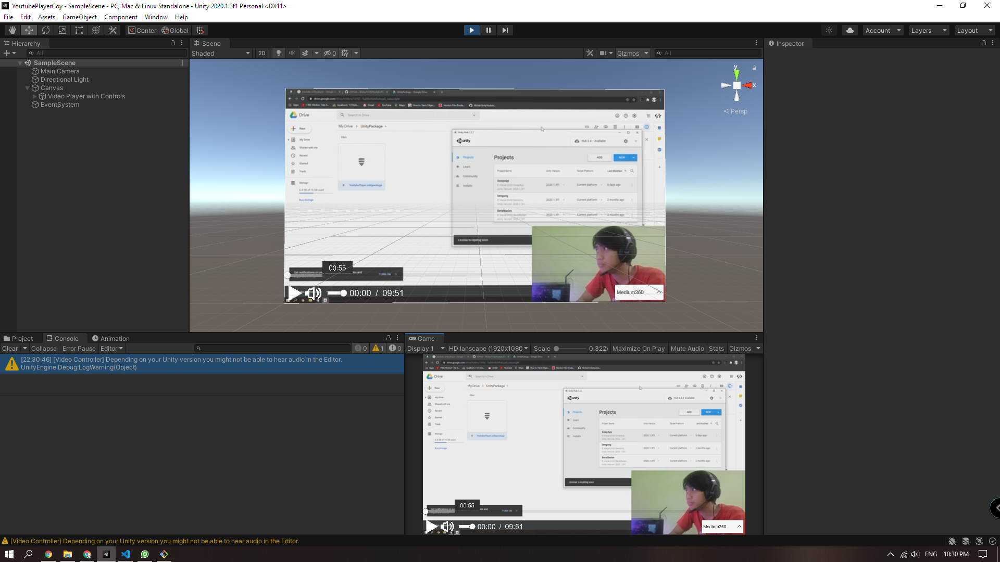
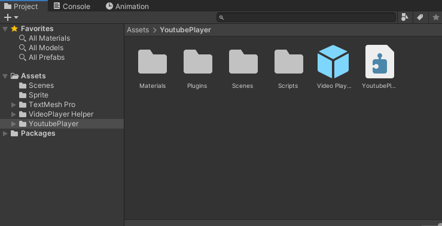
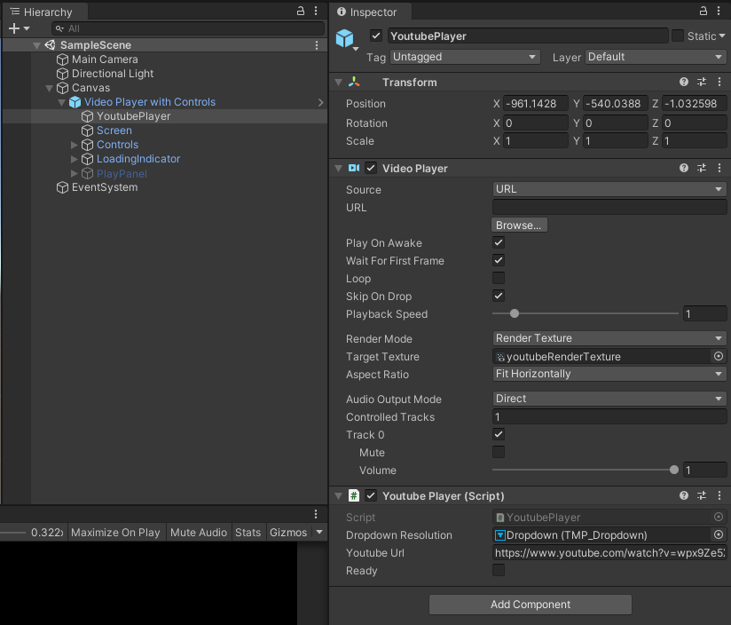

# YoutubePlayer-unity
## Preview

This player is only used for YouTube and gives control, speed up videos, stop and start videos, and choose video quality

## Usage
- Add a `Youtube Player With Control` prefabs on your canvas.

- Edit your youtube url in `Youtube Player Script`.

- Make sure video player use url method, and the url is empty.
- When it play, `Youtube Player Script` had public boolean called `ready` it means indicator for youtube player had load the video and ready to play.

- Note : I disable a few features of video player helper, like click on screen and fullscreen feature. I think it's not stable yet. maybe in future I will add it.
